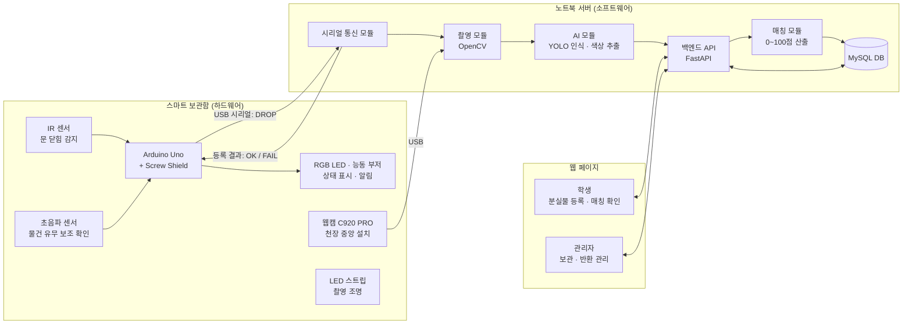
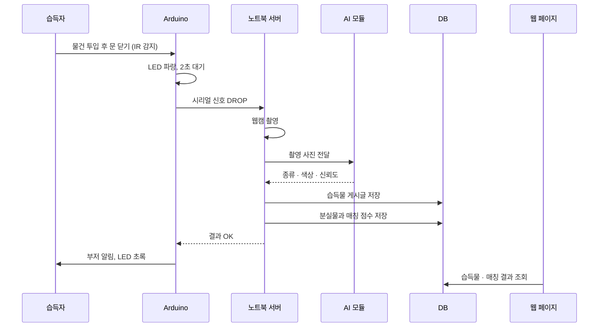

# 캡스톤디자인 작품 개발계획서

## 1. 작품 개요

### 1.1 작품명

**FindBox: AI 기반 스마트 분실물 보관함**

### 1.2 작품 분야

IoT(Arduino 센서 제어) · 인공지능(객체 탐지) · 데이터베이스 · 웹 서비스

### 1.3 작품 개요

학교에서 습득한 물건을 스마트 보관함에 넣으면 센서가 투입을 감지하고 카메라가 자동으로 사진을 촬영하여, AI가 물건의 종류와 색상을 인식한 뒤 웹 게시판에 습득물로 자동 등록하는 시스템을 개발한다.

학생은 웹페이지에 잃어버린 물건의 이름, 종류, 색상, 분실 장소, 분실 시간, 특징, 사진을 등록할 수 있으며, 시스템은 등록된 분실물과 새로 들어온 습득물을 비교하여 **같은 물건일 가능성을 0~100점의 매칭률과 매칭 이유로 제공**한다.

관리자는 웹페이지에서 등록된 분실물과 습득물을 확인하고, 분실자 본인 여부를 확인한 후 물건을 반환하며 '보관 중 / 반환 완료' 상태를 관리한다.

### 1.4 주요 기능

* 보관함 문 닫힘 감지 및 습득물 자동 촬영
* YOLO 기반 습득물 종류 인식 및 대표 색상 추출
* 습득물 게시글 자동 생성 (사진, 보관함 위치, 등록 시간, 인식 결과)
* 학생의 분실물 게시글 등록
* 분실물–습득물 AI 매칭 (0~100점 매칭률 및 항목별 매칭 이유)
* 관리자 페이지 (보관·반환 상태 관리, 개인정보 포함 사진 비공개 처리)
* 보관함 상태 표시 (RGB LED) 및 등록 완료 알림음 (부저)

---

# 2. 개발 배경 및 필요성

## 2.1 개발 배경

학교에서는 학생들이 이어폰, 지갑, 학생증 등 다양한 물건을 자주 잃어버린다. 그러나 현재 분실물은 학생복지과 등에 수동으로 보관되는 경우가 많고, 학생은 물건을 찾기 위해 직접 방문하여 확인해야 한다.

또한 분실자와 습득자가 서로를 찾기 어렵고, 습득물 정보가 체계적으로 공개되지 않아 물건이 장기간 방치되거나 주인에게 돌아가지 못하는 문제가 발생한다. 습득자 입장에서도 물건을 어디에 맡겨야 할지 모르거나 신고 절차가 번거로워 습득물을 그대로 두는 경우가 많다.

이에 따라 **습득자는 물건을 보관함에 넣기만 하면 되고, 분실자는 웹에서 매칭 결과를 확인할 수 있는** 스마트 분실물 보관함 시스템을 개발하고자 한다.

## 2.2 개발 필요성

1. 습득물 신고·등록 절차 간소화 (넣기만 하면 자동 등록)
2. 분실자가 직접 방문하지 않고도 웹에서 습득물 확인 가능
3. 분실물과 습득물의 자동 매칭으로 반환 시간 단축
4. 관리자의 분실물 관리 업무 부담 감소
5. IoT·AI·DB·웹을 통합한 실무형 시스템 개발 경험 확보

---

# 3. 개발 목표 및 주요 기능

## 3.1 개발 목표

센서와 카메라를 이용해 습득물을 자동으로 인식·등록하고, 학생이 등록한 분실물 정보와 AI 기반으로 매칭하여 분실물을 빠르고 편리하게 찾을 수 있도록 지원하는 **스마트 분실물 보관함 시스템**을 개발한다.

※ 본 과제는 습득물의 **자동 인식·등록·매칭 기능 구현에 집중**하며, 반환은 관리자가 본인 확인 후 직접 전달하는 방식으로 운영한다. 보관함 자동 잠금 등 보안 기능은 향후 확장 과제로 둔다.

### 정량적 성과목표

| 평가항목 | 개발 목표 |
|-|-|
| 인식 물품 종류 | 교내 분실 빈도가 높은 물품 5종 (지갑, 무선 이어폰, 학생증·카드, 휴대폰, 텀블러·물병) |
| 학습 데이터 | 보관함 촬영 환경에서 직접 수집한 사진 종류별 100장 이상 |
| 물품 인식 정확도 | YOLO 모델 mAP50 0.8 이상 |
| 문 닫힘 감지 | 30회 시험 중 95% 이상 정상 감지 |
| 자동 등록 시간 | 문 닫힘부터 게시글 등록까지 10초 이내 |
| 매칭 정확도 | 시험 시나리오 30건 중 실제 주인의 분실물이 매칭 상위 3위 이내 80% 이상 |
| 서비스 환경 | PC 및 모바일 웹브라우저에서 실행 |

## 3.2 주요 기능

### ① 습득물 자동 감지 및 촬영

습득자가 보관함 문을 열고 물건을 넣은 뒤 문을 닫으면 IR 센서가 문 닫힘을 감지한다. 손이 빠지고 물건이 안착할 때까지 약 2초 대기한 후, Arduino가 노트북에 시리얼 신호를 보내 웹캠이 보관함 내부를 촬영한다.

### ② AI 습득물 인식

촬영된 사진에서 YOLO 모델로 물건의 종류와 위치를 탐지하고, 탐지된 영역에서 OpenCV로 대표 색상을 추출한다. 물건이 탐지되지 않으면 오감지로 판단하여 등록하지 않는다.

### ③ 습득물 게시글 자동 등록

인식 결과(종류, 색상), 촬영 사진, 보관함 위치, 등록 시간을 바탕으로 습득물 게시글을 자동 생성한다. 학생증·신분증 등 개인정보가 포함될 수 있는 물품은 사진을 관리자에게만 공개한다.

### ④ 분실물 등록

학생이 웹페이지에서 잃어버린 물건의 이름, 종류, 색상, 분실 장소, 분실 시간, 특징 설명, 사진을 등록한다.

### ⑤ AI 매칭 및 매칭 이유 제공

분실물과 습득물을 종류·색상·장소·시간·특징 항목별로 비교하여 0~100점의 매칭률을 산출하고, 항목별 일치 여부를 매칭 이유로 함께 보여준다.

### ⑥ 관리자 관리

관리자는 전체 분실물·습득물 목록을 확인하고, 매칭 결과를 참고하여 본인 확인 후 반환하며 '보관 중 / 반환 완료' 상태를 변경한다.

### ⑦ 보관함 상태 표시

RGB LED로 보관함 상태(초록: 대기, 파랑: 촬영·인식 중, 빨강: 오류)를 표시하고, 등록이 완료되면 부저로 알림음을 출력한다.

---

# 4. 작품 설계 및 개발 방법

## 4.1 전체 시스템 구성

**습득자 → 보관함(센서·카메라) → 노트북 서버(AI 인식·매칭) → DB → 웹 페이지 → 분실자·관리자**

## 4.2 개발 기술

| 구분 | 사용 기술 |
|-|-|
| 하드웨어 제어 | Arduino Uno, Arduino IDE (C/C++) |
| 하드웨어–서버 통신 | USB 시리얼 통신 (pySerial) |
| 영상 처리 | Python, OpenCV |
| AI | YOLO26s (Ultralytics), 라벨링 도구 (Roboflow 또는 LabelImg) |
| AI 학습 환경 | Google Colab (GPU), 학습된 모델은 노트북에서 추론 |
| 백엔드 | Python, FastAPI |
| 데이터베이스 | MySQL |
| 웹 프론트엔드 | HTML, CSS, JavaScript |
| 협업 | GitHub |
| 개발환경 | Windows 노트북, VS Code |

## 4.3 개발 방법 (습득물 자동 등록 흐름)

① 습득자가 보관함 문을 열고 물건을 넣은 뒤 문을 닫음  
↓  
② IR 센서가 문 닫힘 감지 → RGB LED 파랑으로 변경  
↓  
③ 2초 대기 후 초음파 센서로 물건 안착 보조 확인  
↓  
④ Arduino가 노트북에 시리얼 신호(DROP) 전송  
↓  
⑤ 웹캠으로 보관함 내부 촬영 (초점·노출 고정)  
↓  
⑥ YOLO로 물건 종류 탐지, OpenCV로 대표 색상 추출  
↓  
⑦ 탐지 결과가 없으면 오감지로 판단하여 종료 (LED 빨강)  
↓  
⑧ 습득물 게시글 DB 저장 및 웹 게시판 자동 등록  
↓  
⑨ 기존 분실물 게시글과 매칭 점수 산출 및 저장  
↓  
⑩ Arduino에 결과(OK) 전송 → 부저 알림음, LED 초록 복귀

---

# 5. 개발 일정 및 역할 분담

## 5.1 팀원별 역할

소프트웨어는 **웹 페이지, 백엔드·DB, AI** 세 영역으로 나누어 각 팀원이 하나씩 담당한다. 하드웨어는 특정 담당자를 두지 않고 **3명이 공동으로 수행**한다.

| 팀원 | 주요 담당 | 세부 업무 |
|-|-|-|
| **엄서연** | 웹 페이지 | 화면 설계, 분실물 등록·습득물 게시판·매칭 결과·관리자 페이지 구현, UI/UX 개선, 발표자료 |
| **위세현** | 백엔드·DB | DB 설계·구축, FastAPI 서버 및 API, 습득물 자동 등록, 시리얼 수신, 전체 시스템 통합 |
| **김동영** | AI | 학습 데이터 수집·라벨링, YOLO 학습, 색상 추출, 매칭 알고리즘 |
| **공동** | 하드웨어 | 회로 구성, 센서·LED·부저 제어, 보관함 조립, 촬영 환경 구성 |

※ 3명의 팀원은 담당 분야를 중심으로 개발하되, 하드웨어 작업과 최종 테스트에는 공동으로 참여한다.

---

## 5.2 주차별 개발 일정

| 주차 | 기간 | 주요 개발 내용 | 주담당 | 공동 작업 |
|-|-|-|-|-|
| **1주차** | 9/16~9/20 | 계획 발표, 요구사항 정의, 개발환경 구축, 부품 동작 확인 | 엄서연, 위세현, 김동영 | **전체** |
| **2주차** | 9/21~9/27 | 화면·DB·API 설계, 회로 구성, 보관함 조립, 촬영 환경 구성 | 위세현, 김동영 | 엄서연 |
| **3주차** | 9/28~10/4 | 분실물 등록 화면, DB 구축, 문 닫힘 감지·시리얼 송신, 학습 데이터 수집 | 엄서연, 위세현, 김동영 | 하드웨어 공동 |
| **4주차** | 10/5~10/11 | 습득물 게시판, 자동 촬영·등록 파이프라인, YOLO 1차 학습 | 위세현, 김동영 | 엄서연 |
| **5주차** | 10/12~10/18 | 색상 추출, 매칭 알고리즘, 매칭 결과 화면 | 김동영, 엄서연 | 위세현 |
| **6주차** | 10/19~10/25 | 관리자 페이지, 전체 연동, LED·부저 피드백, YOLO 2차 학습 | 위세현, 엄서연 | 김동영 |
| **7주차** | 10/26~11/1 | 기능 테스트, 인식·매칭 정확도 평가, 오류 수정 | 엄서연, 위세현, 김동영 | **전체** |
| **8주차** | 11/2~11/10 | 최종 보완, 결과보고서·발표자료 작성, 시연 준비 | 위세현, 엄서연 | **전체** |

---

## 5.3 주차별 세부 업무

### 1주차: 요구사항 정의 및 개발환경 구축

**엄서연 (웹)**

* 사용자 이용 시나리오 작성 (습득자·분실자·관리자)
* 필요한 화면 목록 정리

**위세현 (백엔드·DB)**

* 저장할 데이터 항목 정의
* MySQL, FastAPI 개발환경 구축

**김동영 (AI)**

* Python, OpenCV, Ultralytics(YOLO26) 개발환경 구축
* Google Colab 학습 환경 준비
* 사전학습 YOLO 모델로 웹캠 인식 테스트
* 인식 대상 물품 5종 확정 및 종류별 촬영용 물품 준비

**공동 (하드웨어)**

* Arduino IDE 설치 및 Arduino·센서·LED·부저 개별 동작 확인
* 개발계획서 발표 (9/16)
* GitHub 리포지터리 생성 및 협업 규칙 정리

---

### 2주차: 시스템 설계 및 보관함 조립

**엄서연 (웹)**

* 화면 설계 (메인, 분실물 등록, 습득물 게시판, 상세, 매칭 결과, 관리자)
* 페이지 간 이동 흐름 설계
* LED 색상·부저 알림 동작 정의

**위세현 (백엔드·DB)**

* ERD 작성 및 테이블 설계
* API 명세서 초안 작성
* 브레드보드 회로 구성 및 IR 센서 문 닫힘 감지 테스트

**김동영 (AI)**

* 웹캠 천장 고정, LED 스트립·폼보드 배치
* 웹캠 초점·노출 고정값 결정
* 학습 데이터 수집 계획 수립

**공동 (하드웨어)**

* 보관함 배선 구멍 가공 및 부품 부착
* 시스템 설계 검토

**산출물**

* 화면 설계서, ERD, API 명세서
* 조립된 보관함 시제품

---

### 3주차: 기본 기능 개발 및 데이터 수집

**엄서연 (웹)**

* 메인 페이지 및 공통 레이아웃 구현
* 분실물 등록 페이지 구현

**위세현 (백엔드·DB)**

* MySQL 데이터베이스 구축
* 분실물·습득물 등록·조회 API 구현
* Arduino 문 닫힘 감지 → 시리얼 신호 전송 코드 작성

**김동영 (AI)**

* 보관함 내부에서 물품별 사진 촬영 (종류별 100장 이상 목표)
* 촬영 사진 라벨링
* 학습·검증 데이터 분리

**공동 (하드웨어)**

* 초음파 센서 연결 및 물건 안착 확인 테스트
* 학습용 사진 촬영 지원

**산출물**

* 분실물 등록 화면, DB, 기본 API
* 센서 제어 코드
* 라벨링된 학습 데이터

---

### 4주차: 자동 등록 파이프라인 및 YOLO 학습

**엄서연 (웹)**

* 습득물 게시판 목록·상세 페이지 구현
* 분실물 등록 화면과 API 연동

**위세현 (백엔드·DB)**

* 시리얼 신호 수신 → 웹캠 촬영 → 이미지 저장 모듈 구현
* 습득물 자동 등록 API 구현
* 사진 파일 저장 구조 정리

**김동영 (AI)**

* YOLO26s 1차 파인튜닝 (Google Colab)
* 동일 데이터로 YOLO11s 학습 후 성능 비교
* 종류별 인식 성능(mAP50) 측정 및 오인식 사례 분석

**공동 (하드웨어)**

* 문 닫힘 → 촬영까지 연동 동작 점검

**산출물**

* 습득물 자동 촬영·등록 기능
* YOLO 1차 학습 모델

---

### 5주차: 색상 추출 및 매칭 기능 개발

**엄서연 (웹)**

* 매칭 결과 화면 구현 (매칭률, 항목별 매칭 이유)
* 학생증·카드 사진 비공개 표시 처리

**위세현 (백엔드·DB)**

* 매칭 결과 테이블 및 조회 API 구현
* AI 인식 모듈을 자동 등록 흐름에 연결

**김동영 (AI)**

* 탐지 영역 대표 색상 추출 (OpenCV)
* 항목별 가중치 기반 매칭 점수 산출 모듈 구현
* 매칭 이유 문장 생성

**공동 (하드웨어)**

* 조명 반사·그림자 점검 및 촬영 환경 보완

**산출물**

* 색상 추출 기능
* AI 매칭 기능 및 매칭 결과 화면

---

### 6주차: 관리자 기능 및 시스템 통합

**엄서연 (웹)**

* 관리자 페이지 구현 (전체 목록, 보관·반환 상태 변경)
* 모바일 화면 대응

**위세현 (백엔드·DB)**

* 관리자 로그인·상태 변경 API 구현
* 하드웨어·서버·AI·DB·웹 전체 연동

**김동영 (AI)**

* 오인식 데이터 추가 수집 후 YOLO 2차 학습
* 매칭 가중치 조정

**공동 (하드웨어)**

* 등록 결과에 따른 LED 색상·부저 알림 구현
* 배선 정리 및 부품 고정

**산출물**

* 관리자 페이지
* 1차 완성 FindBox 시스템

---

### 7주차: 테스트 및 개선

**엄서연 (웹)**

* 화면별 기능 테스트 및 사용성 평가
* UI/UX 개선

**위세현 (백엔드·DB)**

* 자동 등록 소요 시간 측정
* 오류 및 예외 처리 (카메라 연결 끊김, 중복 등록 등)

**김동영 (AI)**

* 매칭 시험 시나리오 30건 작성 및 평가
* 인식 정확도 최종 측정 및 매칭 알고리즘 개선

**공동 (하드웨어)**

* 문 닫힘 감지 30회 반복 시험
* 테스트 결과 분석 및 오류 수정

**산출물**

* 테스트 결과표
* 오류 수정 내역
* 개선된 FindBox 시스템

---

### 8주차: 최종 완성 및 발표 준비

**엄서연 (웹)**

* 웹 화면 최종 수정
* 발표자료 및 시연 영상 제작

**위세현 (백엔드·DB)**

* 최종 시스템 통합 및 안정성 점검
* 결과보고서 작성 총괄

**김동영 (AI)**

* AI 인식·매칭 기능 최종 점검
* 성능 평가 결과 정리

**공동**

* 보관함 외관 최종 정리
* 최종 기능 테스트
* 시연 시나리오 준비 및 발표 연습

**최종 산출물**

* FindBox 스마트 분실물 보관함 (하드웨어)
* 웹 서비스 및 소스코드
* YOLO 학습 데이터 및 모델
* 결과보고서, 발표자료

---

# 6. 시험·평가 및 성과목표

## 6.1 시험 방법

실제 보관함에 다양한 물품을 넣어 자동 감지·촬영·인식·등록이 정상 동작하는지 확인하고, 미리 등록한 분실물 게시글과의 매칭 결과를 검증한다.

### 시험 시나리오 예시

| 구분 | 시험 내용 | 확인 사항 |
|-|-|-|
| 문 닫힘 감지 | 문을 열고 닫기 30회 반복 | 감지 성공률, 오감지 여부 |
| 빈 보관함 | 물건 없이 문만 닫기 | 게시글이 등록되지 않는지 |
| 자동 등록 | 검정색 반지갑 투입 | 종류 '지갑', 색상 '검정' 인식 및 게시글 생성 |
| 얇은 물건 | 학생증 투입 | 인식 여부, 사진 비공개 처리 |
| 매칭 | "3층 강의실에서 흰색 무선 이어폰 분실" 등록 후 흰색 이어폰 투입 | 매칭 상위 3위 이내 표시 여부 |
| 유사 물품 | 색상만 다른 이어폰 2개 투입 | 매칭률 차이 및 매칭 이유 |
| 관리자 | 반환 완료 처리 | 상태 변경 및 목록 반영 |

## 6.2 평가항목

| 평가항목 | 평가방법 |
|-|-|
| 감지 정확성 | 문 닫힘 감지 성공률 측정 |
| 인식 정확성 | 검증 데이터 기준 mAP50 측정, 실제 투입 시 종류·색상 일치 여부 |
| 매칭 정확성 | 시험 시나리오에서 실제 주인이 상위 3위 이내인 비율 |
| 처리 시간 | 문 닫힘부터 게시글 등록까지 시간 측정 |
| 사용 편의성 | 팀원 및 학생의 사용성 평가 |
| 시스템 안정성 | 연속 투입 및 장시간 동작 시 오류 발생 여부 |

## 6.3 성과목표

* 보관함에 물건을 넣으면 사람의 입력 없이 습득물 게시글 자동 등록
* 교내 분실 빈도가 높은 물품 5종 인식
* 인식 정확도 mAP50 0.8 이상
* 문 닫힘부터 등록까지 10초 이내
* 매칭 시나리오 30건 중 80% 이상 상위 3위 이내 매칭
* PC 및 모바일 웹브라우저에서 정상 이용 가능

---

# 7. 기대효과 및 활용방안

## 7.1 기대효과

### 학생 측면

* 습득한 물건을 보관함에 넣기만 하면 되어 습득물 신고 부담이 줄어든다.
* 분실물을 찾기 위해 직접 방문하지 않고 웹에서 습득 여부를 확인할 수 있다.
* 매칭률과 매칭 이유를 통해 자신의 물건일 가능성을 쉽게 판단할 수 있다.

### 학교 측면

* 습득물 등록과 분류가 자동화되어 관리자의 업무 부담이 줄어든다.
* 장기간 방치되는 분실물이 줄고 반환율이 높아진다.
* 분실물 발생 데이터(장소·시간·종류)를 축적하여 분실 예방에 활용할 수 있다.

### 교육 측면

* Arduino, 영상처리, AI 객체 탐지, 데이터베이스, 웹 개발을 하나의 시스템으로 통합하는 경험을 얻을 수 있다.
* 직접 학습 데이터를 수집·라벨링하고 모델 성능을 개선하는 AI 개발 전 과정을 경험할 수 있다.
* 3명의 팀원이 역할을 분담하여 하드웨어와 소프트웨어를 연동하는 실무 협업 경험을 확보할 수 있다.

## 7.2 활용방안

개발된 시스템은 초기에는 캡스톤디자인 시제품으로 학과 내에서 시범 운영하고, 향후 학생복지과 등 분실물 관리 부서와 연계하여 교내 여러 건물에 보관함을 설치하는 방식으로 확대할 수 있다.

또한 학교뿐만 아니라 **도서관, 기숙사, 지하철역, 공공기관 등 분실물이 자주 발생하는 공간**에 적용하여 무인 분실물 관리 서비스로 발전시킬 수 있다.

## 7.3 향후 발전 방향

1. 매칭 확정 시 인증코드로 열리는 자동 잠금장치 추가
2. 매칭률이 높은 습득물 등록 시 분실자에게 알림 발송
3. 무게 센서를 추가하여 얇은 물건 감지 및 물건 회수 여부 확인
4. 멀티모달 AI를 활용한 특징 설명 자동 생성 및 매칭 정확도 향상
5. 여러 보관함을 통합 관리하는 대시보드 개발
6. 학교 포털 로그인 연동을 통한 본인 확인 간소화
